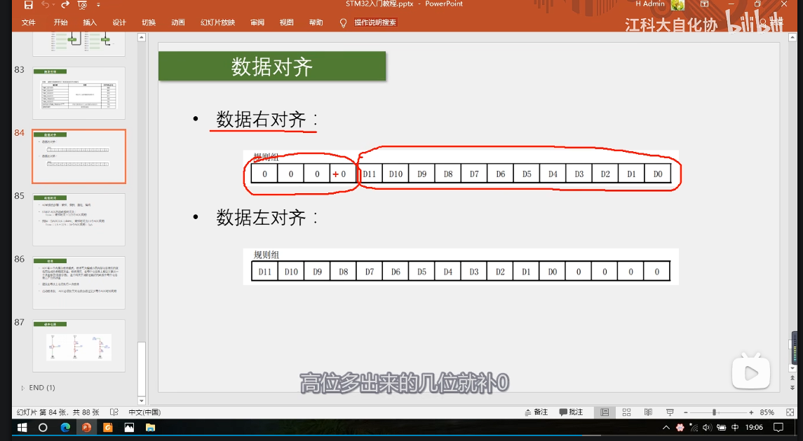
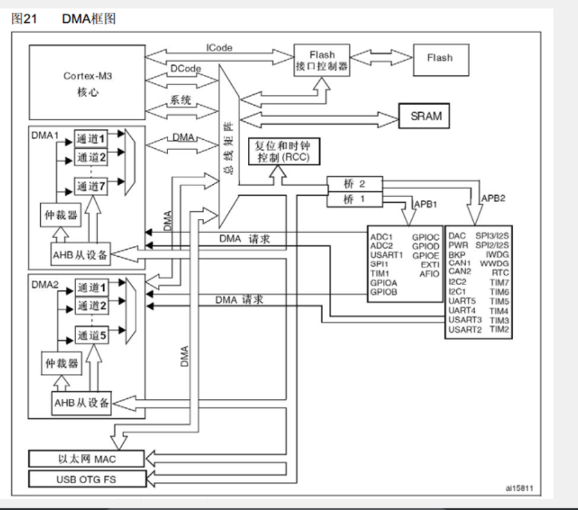

# ADC
模拟看门狗
规则组 结果X1
注入组X4

gpio到ad转化器
开光控制
start/RCC时钟

采样时间长避免毛刺
双通道adc

- 交叉采样
- 或者分别采样
- 同步采样

单次转换
连续转换

连续装换可以实现一次触发一直采样

触发源有
- TIM1__CC1
- TIM1__CC2
- TIM1__CC3
- TIM2__CC2
- TIM3__TRGO
- TIM4__CC4
- EXIT或TIM8_TRGO 外部引脚或片上定时器内部信号
- SWSTART 软件控制位

数据对齐
 由于adc数据为12位而寄存器有16位
 所以需要数据的对齐
 分为左对齐和右对齐
 对齐右边的话，左侧补零
 同理

可以选择扫描通道数

EOC标志位

非扫描模式
扫描模式

ad转换时间
- 采样
- 保持
- 量化
- 编码
时间  = 采样时间+12.5个ADC周期

adc周期的时间是RCC分频出来的结果
最高是14Mhz 为1.5个ADC周期

校准

ADC开关控制
时序图 
定义警戒区域

间断模式

DMA请求

GPIO_mode 
GPIO_Mode_AIN 是 模拟输入
此时GPIO端口无效,内部的下拉和上拉电阻失效，避免了数字电路的噪声和电平干扰其读取，但是==当adc口悬空时，电平也会不确定，只有外接一个下拉电阻才可以保证悬空时电平为确定值，或者直接配置成下拉输入==

==数据输出上建议校准==

- 校准的四个函数
- ADC_ResetCalibreation;
- ADC_StartCailbration;
- ADC_GetResetCalibrationStatus	询问校准情况
- ADC_GetCalibrationStatus 询问复位情况

扫描模式下手动转运数据有点麻烦，得通过delay或着其他的方法  

用非扫描模式实现的方法为：一次读一个，一个接一个

DMA	direct memory access
有着读取flash，core，sram，外设的寄存器的能力，不消耗内部cpu算力，节约cpu的资源

储存器映射
ROM	
- flash 用途： 储存c语言代码编译后的代码
- 系统存储器 ： 储存bootloader，用于串口下载
- 选项字节 ： 存储独立于程序代码的配置参数

RAM
- sram运存 储存运行过程中的临时变量
- 外设寄存器 存储各个外设的配置参数
- 内核外设寄存器 储存内核的各个外设的配置参数

DAM
左侧有访问主动权
右侧为被动单元
由于DMA只有一条数据总线，所以有了仲裁器，当出现多个通道都需要使用总线时仲裁器会根据优先级来分配，而总线矩阵中DMA和cpu都需要使用总线时仲裁器会分配一部分给cpu，保证cpu还可以正常工作
DMA即使主动单元也是被动单元
DMA请求之后就可以读取了

==注意==：
- 软件触发是以最快的速度一直发出DMA请求，使传输计数器不断-1 直到为零
- 自动重装器则会一直循环重装
- 两者一起使用会导致卡死

DMA
[AMBA总线AHB总线协议详解](https://blog.csdn.net/weixin_46022434/article/details/104987905]

adc在装换时要  
