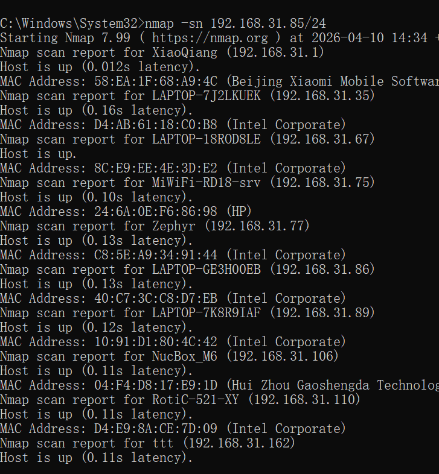
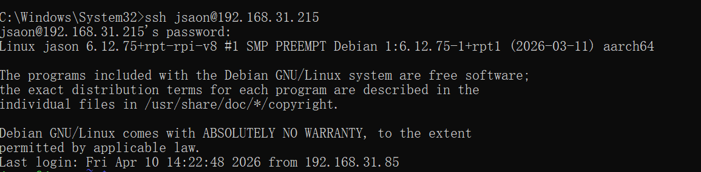
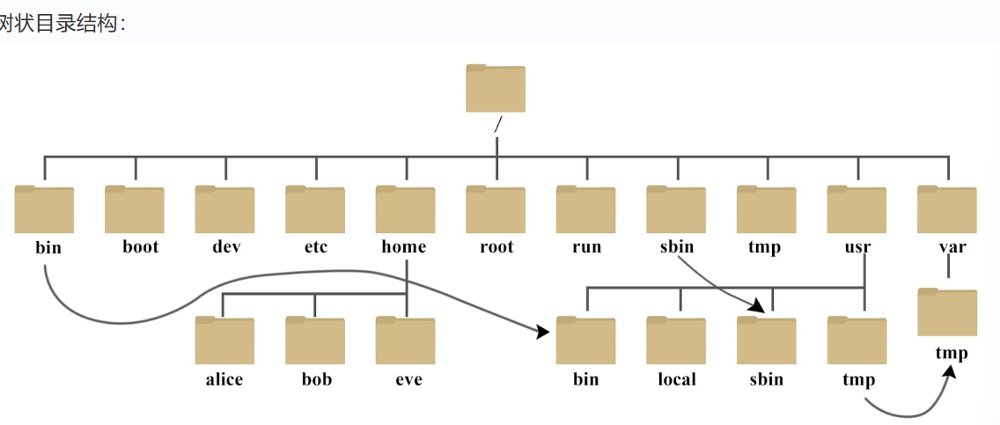
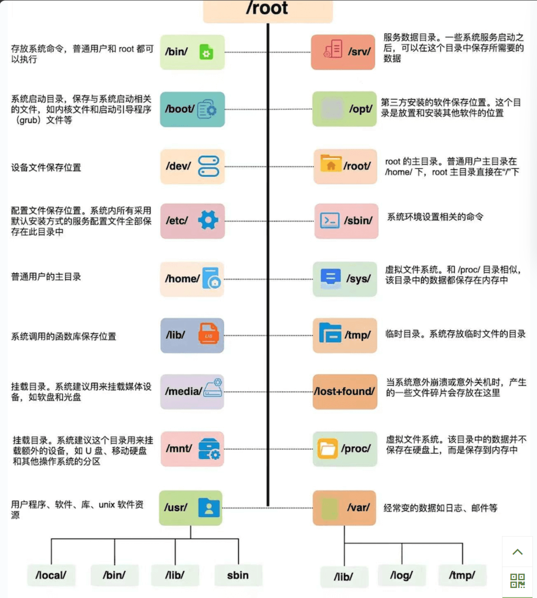

# linux学习
## 一些小tips
### 远程连接树莓派

在命令行中使用
``` bash
sudo nmap -sn 你的网络ip地址/24
```

在其中找到有写着Raspberry Pi Trading的就是我们的树莓派了

接着在命令行里写
``` bash
ssh 你的派的主机名字@它的ip地址
```
接着会出现输入密码的界面
输入密码后就成功连接上我们树莓派的命令行了


### 查看运存

``` bash
free -h
```
查看swap大小
``` bash
sudo swapon --show
```

### 更改软件源

sources.list是系统主要的软件源配置文件（主要是软件包）==在/etc/apt下==
可以更改软件源的地址让日后下载软件有更快的速度

``` bash
sudo nano /etc/apt/sources.list
```
打开文件后写下
```bash
deb https://mirrors.tuna.tsinghua.edu.cn/debian bookworm main contrib non-free non-free-firmware
deb https://mirrors.tuna.tsinghua.edu.cn/debian-security bookworm-security main contrib non-free non-free-firmware
deb https://mirrors.tuna.tsinghua.edu.cn/debian bookworm-updates main contrib non-free non-free-firmware
```
然后exit 选择y 然后回车

接着还有raspi.lise(这是树莓派的固件包)
```bash
sudo nano /etc/apt/sources.list.d/raspi.list
```
在其中写下
```bash
deb https://mirrors.tuna.tsinghua.edu.cn/raspberrypi bookworm main
```
接着相同的操作
### 查看cpu温度

有2种方法
1. vcgencmd命令
```bash
vcgencmd measure_temp
```
或者持续监控（每隔2s)
``` bash
watch -n 2 vcgencmd measure_temp
```

2.读取系统文件
在sys文件里的class中有和温度相关的文件夹
/sys/class/thermal/thermal_zone0/temp
用cat可以抓取
接着用管道运算符传递给awk命令
eg.

```bash
cat /sys/class/thermal/thermal_zone0/temp | awk '{printf "%.2f°C\n",$1/1000}'
```
$1是第一个字段的意思
## linux系统启动过程

五个阶段：
- 内核引导
- 运行init
- 系统初始化
- 建立终端
- 用户登录

## linux系统目录



/下有大量不同类型的文件


## GCC编译原理
- 预处理 cpp(C preprocessor)(gcc -E xxx.c -o xxx.i)
把所有include的内容copy到代码文件里,替换宏定义 去掉注释等
- 编译(compilation) 转汇编 cc1(c语言编译器)(gcc -S xxx.i -o xxx.s)
先检查代码有没有问题,没有问题就会变成cpu懂得汇编

- 汇编(assembly) 汇编转机器码 as(汇编器)(gcc -c xxx.s -o xxx.o)
把汇编语言转化成二进制机器码  此时生成的文件叫目标文件(object file) .o文件 but还不可以运行 只知道要调用但是不知道函数在哪
- 连接(linking) 工具 ld(连接器)(gcc xxx.o -o xxxx)
 把生成的.o文件 和linux自带的C标准库(eg. libc.so) 和其他库拼接在一起 会根据一个链接脚本 linker script 把代码段(flash),数据段(ram)的地址分配好 吐出my_hello

 ## 进程和PID(process ID)
 每个运行的程序都被称为进程,每一个进程有一个专属的身份证