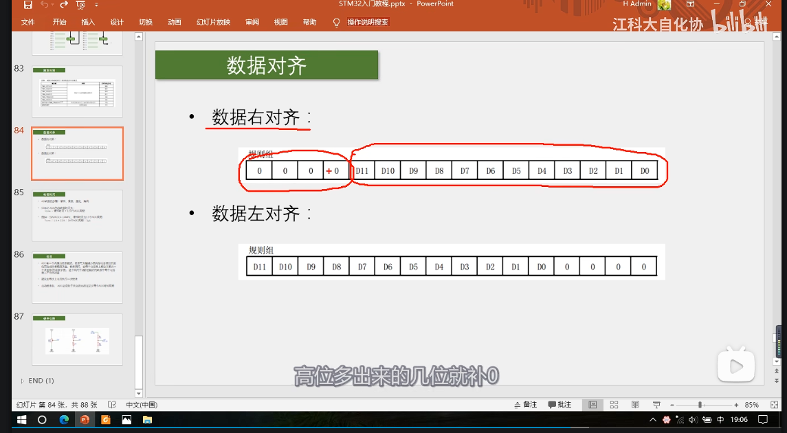
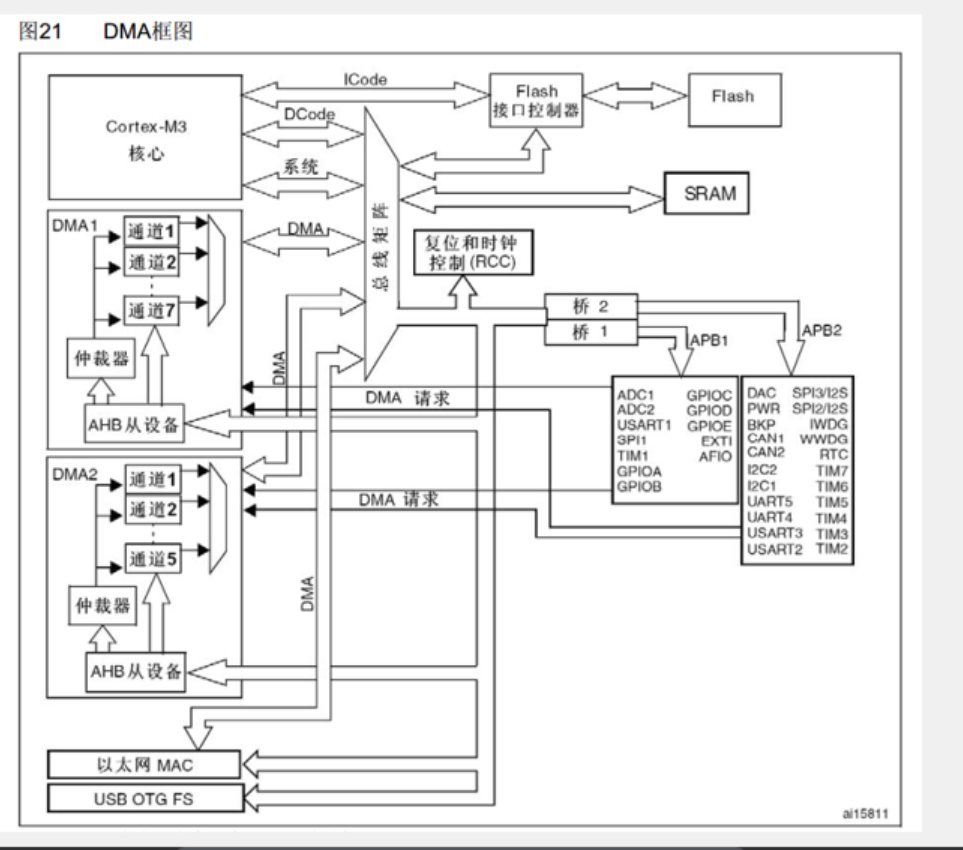

# ADC

## 1. 基本概念
- 模拟看门狗（定义警戒区域）
- 规则组：结果 ×1
- 注入组：结果 ×4

## 2. GPIO 到 ADC 的转换路径
- GPIO 到 AD 转换器
- 开关控制（ADC 开关控制）
- start / RCC 时钟

## 3. 采样与通道
- 采样时间长可以避免毛刺
- 双通道 ADC：
  - 交叉采样
  - 或者分别采样
  - 同步采样

## 4. 转换模式
- 单次转换
- 连续转换：可以实现一次触发一直采样
- 非扫描模式 / 扫描模式
- 可以选择扫描通道数
- 间断模式

## 5. 触发源
- TIM1__CC1
- TIM1__CC2
- TIM1__CC3
- TIM2__CC2
- TIM3__TRGO
- TIM4__CC4
- EXIT 或 TIM8_TRGO：外部引脚或片上定时器内部信号
- SWSTART：软件控制位

## 6. 数据对齐
- 由于 ADC 数据为 12 位而寄存器有 16 位，所以需要数据对齐
- 分为左对齐和右对齐
- 右对齐：左侧补零；同理（左对齐则右侧补零）

## 7. 转换时间
- 流程：采样 → 保持 → 量化 → 编码
- 转换时间 = 采样时间 + 12.5 个 ADC 周期
- ADC 周期的时间是 RCC 分频出来的结果，最高 14MHz，为 1.5 个 ADC 周期
- 时序图

## 8. 标志位与校准
### EOC 标志位

### 校准
- 建议数据输出上校准
- 校准的四个函数：
  - ADC_ResetCalibreation;
  - ADC_StartCailbration;
  - ADC_GetResetCalibrationStatus：询问校准情况
  - ADC_GetCalibrationStatus：询问复位情况

## 9. GPIO 配置（模拟输入）
- GPIO_mode：GPIO_Mode_AIN 是模拟输入
- 此时 GPIO 端口无效，内部的下拉和上拉电阻失效，避免了数字电路的噪声和电平干扰其读取
- ==注意：当 ADC 口悬空时，电平也会不确定，只有外接一个下拉电阻才可以保证悬空时电平为确定值，或者直接配置成下拉输入==

## 10. 扫描模式与非扫描模式的数据转运
- 扫描模式下手动转运数据有点麻烦，得通过 delay 或其他的方法
- 用非扫描模式实现的方法为：一次读一个，一个接一个

## 11. DMA
### DMA 简介
- DMA：direct memory access（直接存储器访问）
- 有着读取 flash、core、sram、外设寄存器的能力，不消耗内部 CPU 算力，节约 CPU 的资源
- DMA 请求之后就可以读取了

### 存储器映射
**ROM**
- flash：储存 C 语言代码编译后的代码
- 系统存储器：储存 bootloader，用于串口下载
- 选项字节：存储独立于程序代码的配置参数

**RAM**
- sram 运存：储存运行过程中的临时变量
- 外设寄存器：存储各个外设的配置参数
- 内核外设寄存器：储存内核的各个外设的配置参数

### DMA 结构
- 左侧有访问主动权（主动单元），右侧为被动单元
- 由于 DMA 只有一条数据总线，所以有了仲裁器：当多个通道都需要使用总线时，仲裁器根据优先级来分配；总线矩阵中 DMA 和 CPU 都需要使用总线时，仲裁器会分配一部分给 CPU，保证 CPU 还可以正常工作
- DMA 既是主动单元也是被动单元

### 注意事项
==注意==：
- 软件触发是以最快的速度一直发出 DMA 请求，使传输计数器不断 -1 直到为零
- 自动重装器则会一直循环重装
- 两者一起使用会导致卡死

## 12. 参考
- [AMBA总线AHB总线协议详解](https://blog.csdn.net/weixin_46022434/article/details/104987905)

## 待补充
- ADC 在转换时要 …
