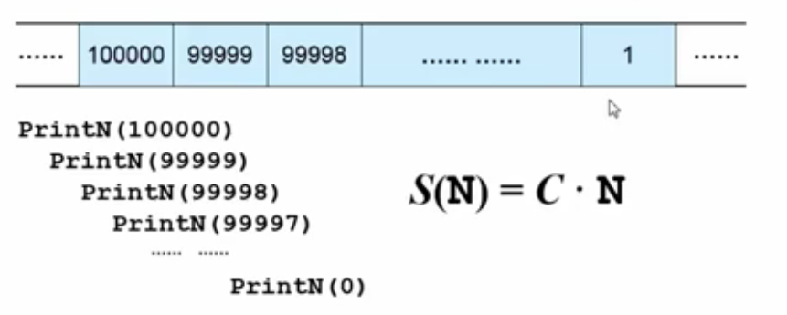
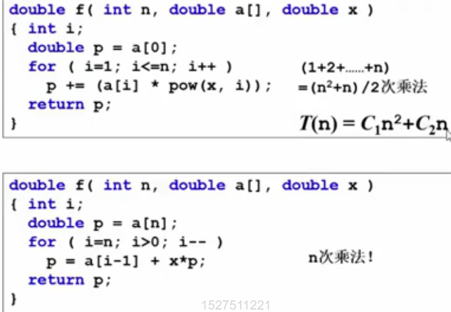

# 数据结构基本概念
## 算法（Algorithm）
 define：
-  一个有限指令集
- 接受一些输入（在有些时候不需要输入
- 有输出
- 有限步骤后停止
- 每一条指令必须 有确定的目标无歧义 计算机力所能及 具有范式不依赖语言本身和具体的实现方式

## 好算法的衡量标准
### 空间复杂度$$S(n)$$
算法写成的程序在执行时占存储单元的长度

eg.
``` c
void printN ( int n ){
    if (N){
        printN(N - 1);
        printf("%d\n",N);
    }
    return ;
}
```
在输入n = 1000000时
系统做了什么呢
一般来说，==系统在使用程序时会把被调用的函数和其状态保存起来，离开时释放==
如果时递归调用，会出现 

最后内存爆了


### 时间复杂度$$T(n)$$
算法写成的程序在执行时花时间的长度

计算机在做计算的时候加减远快于乘法，所以在算时间复杂度的时候一般只用注意乘除法


### 最坏情况复杂度$$T_{worst}(n)$$
### 平均复杂度$$T_{avg}(n)$$
分析一般算法的效率的时候一般关注上面两个复杂度，一般观察==最坏情况复杂度==
$$T_{avg}(n) < T_{worst}(n)$$

## 复杂度的渐进表示法


常见复杂度函数（输入规模为 n）：
$$1$$
$$log n$$ 
$$ n $$
$$n*log n$$
$$n^2$$
$$n^3$$
$$2^n$$
$$n!$$

## 复杂度分析窍门
$T_1(n) = O(f_1(n))$和$T_2(n) = O(f_2(n))$
 - $T_1(n) + T_2(n) = max(O(f_1(n)) + O(f_2(n)))$两段代码拼在一起，去复杂度最大的部分
 - $T_1(n) * T_2(n) = O(f_1(n) * f_2(n))$嵌套使用
if $T(n)$是关于n的k阶多项式，则$T(n)=O(n^k)$
for循环的时间复杂度 = 循环次数 * 循环题代码复杂度
if-else  结构的复杂度取决于if的判断条件的复杂度和其两个分支的复杂度，总体复杂度取三者MAX
