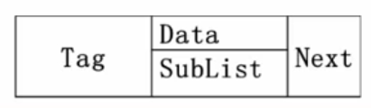
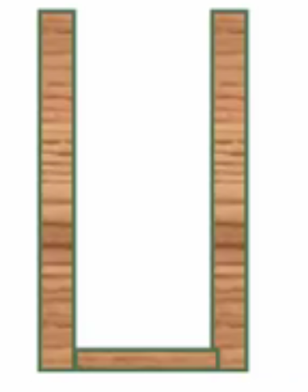
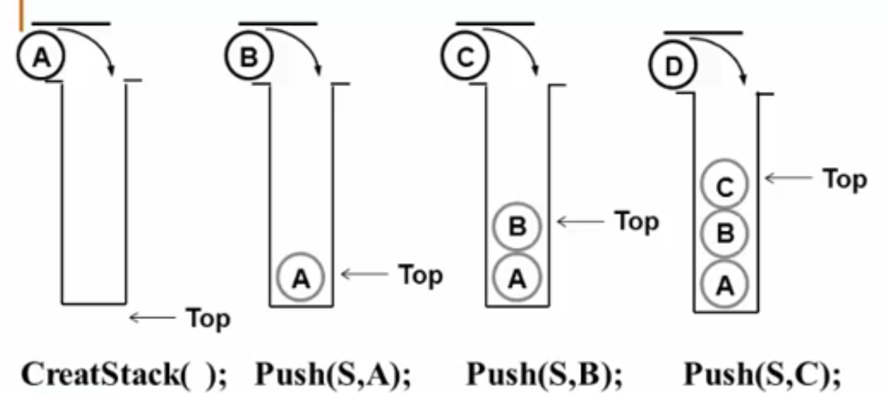
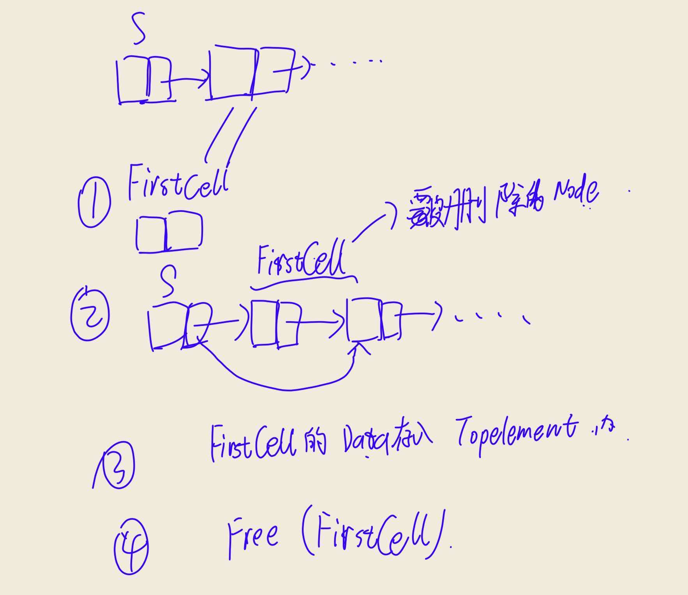
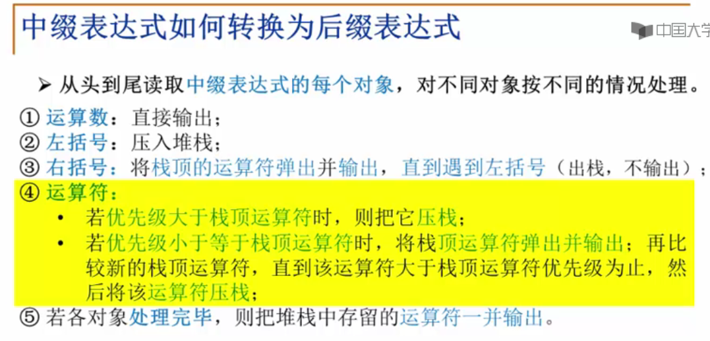

# 线性结构
元素关系：1对1
存储为空间顺序存放
例子：数组 链表 栈 队列
适用：数据有先后顺序

## 线性表（List）
define：由同类型==数据元素==构成==有序序列==的线性结构
抽象化的基本操作
L属于List 整数i为位置 元素X属于ElementType
1. init线性表 List MakeEmpty() ;
2. 用表位置查看对应元素 ElementType Findkth(int K,List L);
3. 查元素X在L第一次出现的位置i : int Find(ELementType X,List L)；
4. 插入元素X: void insert(ELementType X , int i, List L );
5. 删除指定位置的元素:  void Delete(int i , List L );
6. 读表长度n: int Length(List L);

### 链表实现
目标：不要求逻辑上相邻的两个元素物理上也相邻，插入删除不需要移动物理位置，只需要改变链的指向
header -> {a1,next} -> {a2,next} ······ ->{an-1,next} -> {an,null}
``` C
typedef struct LNode* List;
struct LNode{
    ELementType Data;
    List Next;
};
struct LNode L;
List PtrL;
```
求表长
``` C 
int Length(List PtrL){
    List P = Ptrl;
    j = 0;
    while(P){
        P = P->Next;
        j++;
    }
    return j;
}//O(n)
```
查找（按序查找FindKth
```C
List FindKth(int k,List Ptrl){
    List p = Ptrl;
    int cnt = 1;
    while(p != NULL && cnt < k){
        p = p->Next;
        cnt++;
    }
    if( cnt == k){
        return p;
    }else return NULL;
}
```
 查找（按值查找
 ``` C
 List Find(ElementType X,List Ptrl){
    List p = Ptrl;
    while(p != NULL && p->Data != X){
        p = p->Next;
    }
    return p;
 }
 ```
插入（在第i-1的位置插入一个X节点（1 <= i <= n+1)
```  C
List insert(ElementType X,int i,List Ptrl){
    List p,s;
    if(i == 1){
        s = (List)malloc(sizeof(struct LNode));
        s->Data = X;
        s->Next = Ptrl;
        return s;
    }
    p = FindKth(i-1,Ptrl); //此时已经排除了i==1的可能，如果i-1不存在，说明前面没有数
    if(p == Null){
        printf("i error");
        return NULL;
    }else{
        s = (List)malloc(sizeof(struct LNode));
        s->Data = X;
        s->Next = p->Next;
        p->Next = s;
        return Ptrl;
    }
}
```
删除（删除链表的第i个的节点
``` c
void delete(int i,List ptrl){
    List p,s;
    if(i == 1){
        s = ptrl;
        if(ptrl != NULL) ptrl = ptrl->Next;
        else return NULL;
        free(s);
        Return ptrl;
    }
     p = findKth(i-1,ptrl);
     if(p == NULL){
         printf("此节点不存在");
         return NULL;
     }else{
         s = p->Next;
         p->Next = s->Next;
         free(s);
        return ptrl;
    }
}
```

### 广义表
- 广义表是线性表的推广
- 广义表中元素不仅可以是单位素也可以是另外一个广义表
抽象的变量声明
``` C
typedef struct GNode* GList;
struct GNode {
   int tag;//表明节点状态
    union {
        ELementType Data;
        GList SubList;
    }URegion;
    GList Next;
};
```
如图所示


### 多重链表
define：链表的节点可能同时隶属多个链
- 其中的结点的==指针域会有多个==，eg.广义表的包含Next和SubList;
- but 包涵两个指针域的链表不一定是多重指针，可能是双向链表等
 用途：树，图等相对复杂的数据结构可用多重指针进行储存

---------
后缀表达式：
符号位于两个运算数之后：
eg.a b c * + d e / -
扫描到a b c后发现 * 做 b * c,然后发现+后做a+(b * c)依此类推
等价于a+ b * c -d/e(我们平时的运算，即中缀表达式)

可以想象有一个杯子:
往里面放东西然后拿出来只能从上面取和做操作
依旧用上面的例子:

先放a进入再放b和c，接着发现有一个操作动词，取出最后放进去的两个做运算然后放回去，以此类推


---------
## 堆栈（stack）
具有一定操作约束的线性表（可以看做一个杯子）
- ==只能在一端（栈顶，Top）做插入、删除==
插入数据:Push(入栈)
删除数据：Pop（出栈）
先入后出：Last In First Out(LIFO)
数据对象集:一个有0或者多个元素的有穷线性表
操作集：Length == MaxSize的堆栈S属于Stack，其中的元素item属于ElementType

### 操作
1. Stack CreateStack(int MaxSize); 生成一个空堆栈，最大为MaxSize(给自己选一个用来装东西的杯子，事先规定好容量)
2. int IsFull(Stack S,int MaxSize); 判断堆栈是否满了
3. void Push(Stack S,ElementType item); item入栈
4. ElementType Pop(Stack S); 删除并返回栈顶元素
5. int IsEmpty(Stack S); 判断S是否为空
类似下图


### 抽象数据结构实现
#### 数组的方式实现存储
结构常为一个一位数组＋一个顶部数据组成(数组的方式实现)
即
``` C
#define MaxSize < xxx >
typedef struct SNode* Stack;
struct SNode{
    ElementType Data[MaxSize];
    int Top;//指向顶栈元素的下标
};
```

push 入栈
``` C
void push(Stack PtrS,ElementType item){
    if(PtrS->top == MaxSize - 1 ){//判断stack是否被占满
        printf("stack is full");
         return ;   
    }else{
        PtrS->Data[++([PtrS->Top]) = item;
        return;
    }
}
```

Pop 出栈
``` C
 ElementType Pop(Stack PtrS){
     if(PtrS->Top == -1){
         printf("stack is empty");
         return ERROR;
     }else{
         return (PtrS->Data[(PtrS->Top)--]);
     }
 }
```


#### 链式存储实现方式
本质就是一个单链表，即==链栈==，只能在栈顶(top)做操作，由于是单向表，所以用header做为top（~~如果用tail的话，都不知道前一个在哪里~~)
``` C
typedef struct SNode* Stack;
struct SNode{
    ElementType Data;
    struct SNode* Next; 
}
```

create一个stack(应该说是一个top)
``` C 
Stack CreateStack(){
    Stack S;
    S = (Stack)malloc(sizeof(struct SNode));
    S->Next = NULL;
    return s; /*放回的其实就是top*/
}
```

 判断是否为空栈
 ``` C
 int IsEmpty(Stack S){
     return (S->Next == NULL);
 }
 ```

入栈Push
``` C
void Push(Stack S,ElementType item){
    struct SNode* TempCell;
    TempCell = (struct SNode*)malloc(sizeof(struct SNode));
    TempCell->Data = item;
    TempCell->Next = s->Next;
    s->Next = TempCell;
    return;
}
```

出栈Pop
``` C
ElementType Pop(Stack S){
    struct SNode* FirstCell;
    ElementType TopElement;
    if( IsEmpty(S) ){
        printf("stack is empty");
        return NULL;
    }else{
        FirstCell = S->Next;
        S->Next = FirstCell->Next;
        TopElement = FirstCell->Data;
        free(FirstCell);
        return TopElement;
    }
}
```

##### 中缀转后缀


### 其他用途
- 函数调用和递归实现
- 深度优先搜索
- 回溯算法
·····

## 队列(Queue)
具有一定操作约束的线性表
- 插入和删除操作:一端插入另一端删除
数据对象集：一个0或多个元素的有穷线性表
操作集：长度为MaxSize的队列Q属于Queue,队列元素item属于ElementType
操作：
1. Queue CreateQueue(int MaxSize); 生成长度为MaxSize的空队列
2. int IsFully_Q(Queue Q,,int MaxSize); 判断队列Q是否为已满
3. void Add_Q(Queue Q,ElementType item); 入队，放入队尾
4. ElementType Delete_Q(Queue Q); 出队，删除队首的元素并且返回该元素
5. int IsEmpty_Q(Queue Q); 判断队列Q是否为空

### 队列的顺序存储实现方式
用一个一维数组和一个记录队列的头元素位置和变量front和一个记录队尾变量的rear组成
``` C
#define MaxSize <xxx>
typedef struct QNode* Queue;
struct QNode{
    ElementType Data[MaxSize];
    int front; //指向一个永远不放元素的空位（哨兵位）,带头节点
    int rear;
};
```
入队
``` C
void Add_Q(Queue PtrQ,ElementType item){
    if((PtrQ->rear+1)%MaxSize == PtrQ->front){//顺环队列判断是否满了
        printf("Queue is full");
        return ;
    }else{
        PtrQ->rear = (PtrQ->rear+1)%MaxSize;/*顺环队列，如果下一个下标大于MaxSize就会循环，回到0*/
        PtrQ->Data[PtrQ->rear] = item;
        return;
    }
}
```
出队
``` C
ElementType Delete_Q(Queue PtrQ){
    if(PtrQ->rear == PtrQ->front){
        printf("Queue is empty");
        return ERROR;
    }else{
        PtrQ->front = ((PtrQ->front + 1) % MaxSize);
        return PtrQ->Data[PtrQ->front];
    }
}
```

### 链式存储实现
其结构可以是单链表
front做删除操作，rear做插入操作
``` C
struct Node{
    ElementType Data;
    struct Node* Next;
};/*节点结构*/
struct QNode{
    struct Node* front;
    struct Node* rear;
};/*队列结构*/
typedef struct QNode* Queue;
Queue PtrQ;
```

入队
``` C
void Add_Q(Queue PtrQ,ElementType item){
    struct Node* TempCell;
    TempCell = (struct Node*)malloc(sizeof(struct Node));
    
    TempCell->Data = item;
    TempCell->Next = NULL;
    if(PtrQ->rear == NULL){
        PtrQ->rear = PtrQ->front = TempCell;
    }else{
        PtrQ->rear->Next = TempCell;
        PtrQ->rear = TempCell;
    }
}
```

出队(不带头节点，即不带哨兵位)
``` C
ElementType Delete_Q(Queue PtrQ){
    struct Node* FrontCell;
    ElementType FrontElement;

    if(PtrQ->front == NULL){
        printf("Queue is empty");
        return ERROR;
    }
    FrontCell = PtrQ->front;
    if(PtrQ->front == PtrQ->rear){
        PtrQ->front= PtrQ->rear = NULL;
    }else{
        PtrQ->front = PtrQ->front->Next;
    }
    FrontElement = FrontCell->Data;
    
    free(FrontCell);
    return FrontElement;
```


