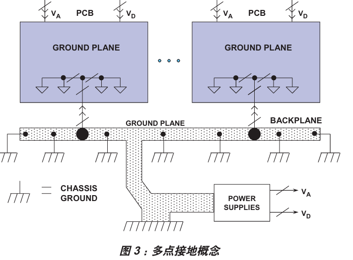
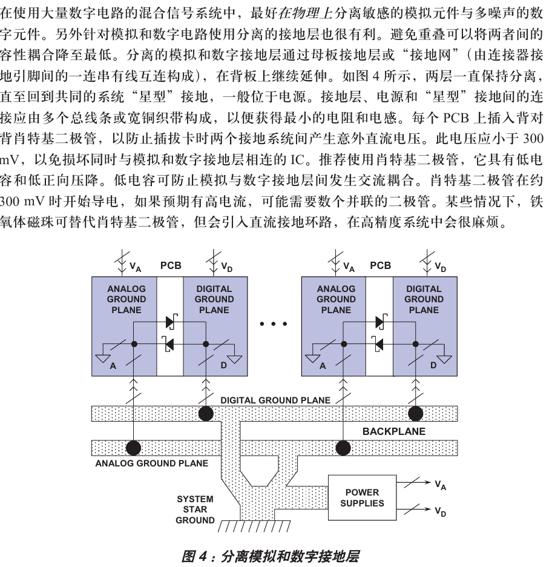
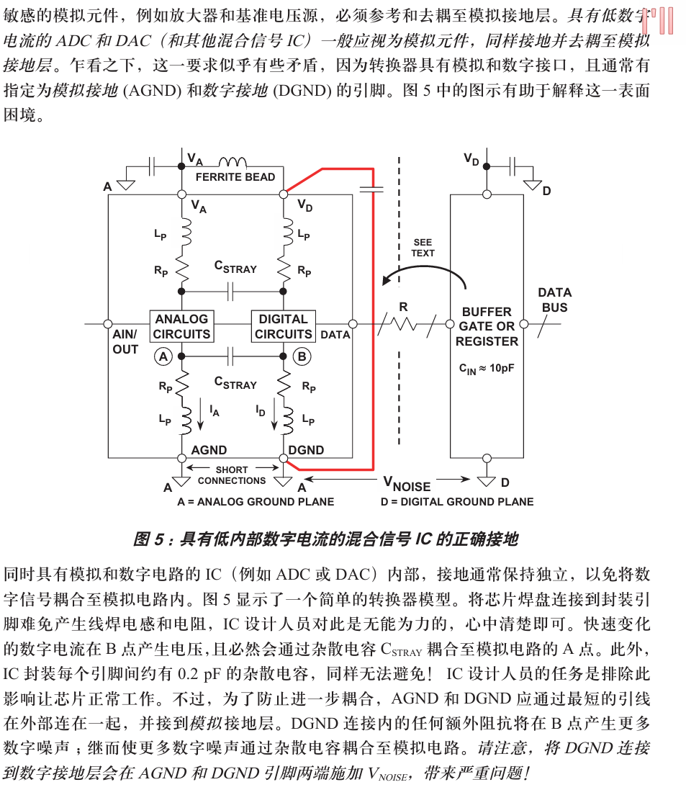

# 分地

## 接地层和电源层

对模拟地和数字地 最重要的 保持低阻抗大面积的接地层 

接地层作用：去耦高频电流（from快速数字逻辑）的低阻抗回路 降低emi/rfi到最低 具有屏蔽作用，降低外部EMI/RFI的影响

接地层：还可以用微带线/带状线 传输高速数字或者模拟信号（要可控阻抗）

由于母线在大多逻辑转换等效f下有相同阻抗，不能将其视为地。eg.

22awg的导线每1英寸有约22nH的电感。 若逻辑信号产生的压摆率为10mA/ns 的瞬态电流
$$
\triangle V = L*\triangle i/ \triangle t = 20nH*10mA/ns = 200mV
$$
对于V~p-p~=2v的信号有着10%的误差,在全数字电流中也会减低逻辑噪声的裕量

https://blog.csdn.net/Britripe/article/details/105264681

对于接地返回导线，模拟电路和数字电路共享 ，会导致存在大量误差,解决方法就是 数字返回电流路径直接回到gnd ref，即 单点接地或者星形接地 ，但是实际情况是没法做到真正的单点接地 由于回流路径的导线必然有寄生参数的引入，很难获得低阻抗高频接地（必须得有大面积接地层）。实现$ \triangle V $尽可能小
在高频下所有ic得接地引脚应该尽可能何低阻抗接地层连接
ps：避免用插槽，会引入寄生参数

## 去耦
通过高质量的电解电容去耦至接地层（在电容接地的地方和ic的接地引脚旁边打过孔） 将电源线路上的低频噪声降低到最低
在每个独立模拟的ic封装的电源引脚需要，需要局部的高频滤波

## 双面和多面印刷电路板
至少有一层完整的接地层
理想情况，双层板有一面应该完全接地 另一面用于互联（实际不可能）
混合信号的电路板的布局一般不能让仍由回流自己流，因此建议受用干预

高密度ic的系统 一般需要多层板。至少有一层专门用于接地 
最简单的四层板（内部接地层和电源层），外部两层互联
电源层和接地层彼此相邻得地方接入层间电容 -> 利于高频去耦

## 多卡混合信号系统（人话 几个板连接）
降低阻抗的方案 使用母板pcb 作为卡间互联背板 
pcb连接引脚至少30% - 40% 专用于接地 
实现系统接地的方案有2种可能途径：
1. 多点接地 从而扩散到机壳接地(常用于全数字系统)
 
2. 星型接地（用于模拟和数字 相互分离 高速  混合 信号 系统）

## 分离模拟地和数字接地层

分离敏感元件的模拟器件和多噪声的数字元件

分离地层 

避免重叠可以降低两者间的容性耦合
接地层之间的阻抗尽可能低 直至回到星型接地点；原因：两层之间有300mV的电压会损坏ic 也会导致逻辑门误触发

- （容性耦合（capacitive coupling）又称电场耦合或静电耦合，是**由于分布电容的存在而产生的一种耦合方式，指电路间通过电场及互电容传递信号或能量的过程**。 该现象常见于电力工程、电子电路及无线通信领域，耦合强度受干扰源电压变化率、线路间距及负载阻抗等因素影响。 其作用机理涉及导体间的分布电容与变化的电场（du/dt）。）

## 具有低数字电流的接地和去耦混合信号ic

添加输入电容（低电感陶瓷型）（0.01uf~0.1uf)

## 采样时钟考量
高性能采样数据系统要用低相位噪声振荡器的adc/dac时钟，时钟抖动会调制模拟输入/输出信号 真加噪声和失真底 因此其必须和高频的数字电路隔离开，同时接地和去耦至模拟层
$$
SNR = 20 lg[1/(2*pi*f*t~j~)]
$$
SNR 指 完美无限分辨率adc的snr
t~j~时钟抖动 $ tj = sqrt(t外部时钟抖动^2+tadc内部时钟抖动^2) $

通常可以忽略哈（

==布局指南==
多关注布局并防止不同信号彼此干扰 降低噪声
低电平模拟信号和高电平模拟信号分离 远离数字信号
时钟信号（有大量噪声同时又怕干扰）要和数字和模拟系统隔离开
敏感信号经过的地方接地层可以发挥屏蔽作用 敏感区相互隔离开 信号路径尽可能短
pcb连接器有30%~40%的引脚用来当作接地连接引脚（随着使用时间变长，每个引脚的阻抗增加，多留一些是必要的 ）
