# 开关电源——dcdc

电路的消耗功率小,损耗来源：开关时mos的米勒平台，


## 非隔离式dcdc变换器

### buck电路

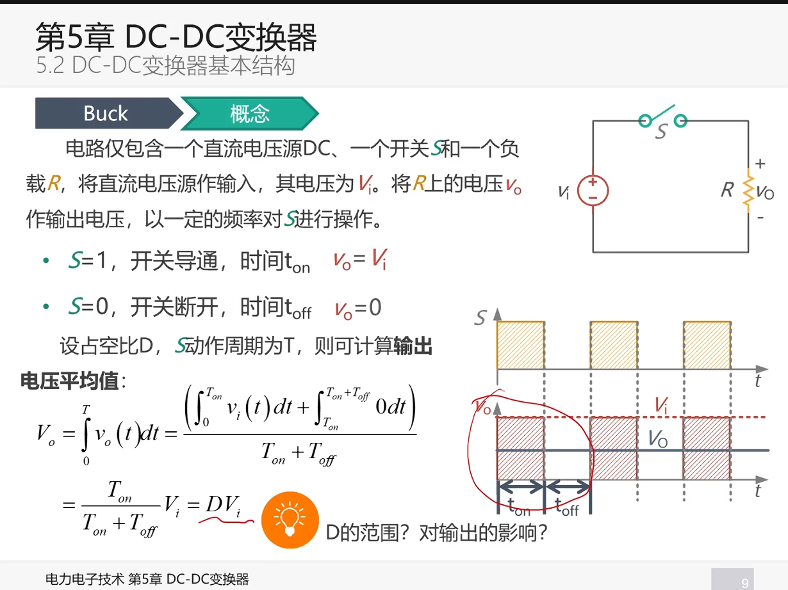
上图的问题：

- 电压波动过大，要尽可能平滑 -> 并联电容
- 用电子开关实现

buck拓扑结构推导

```
电压源不可以直接并联电容
电流源不能可以直接串联电感
```
$$
i = c*du/dt  
$$
```
	当电压源两端直接接入电容，由于电容两端电压不可以突变，但是又有一个恒压源，就会导致电流特别大，开关和电源受不了这么大的电流，所以要加入电感去抑制电流的变化
	但是当开关关断时会抑制电流变化，产生一个续流的电流，需要将这部分能量释放掉，选择使用一个可以续流的器件，所以可以选择一个类似单刀双置开关，用mos和二极管实现
```
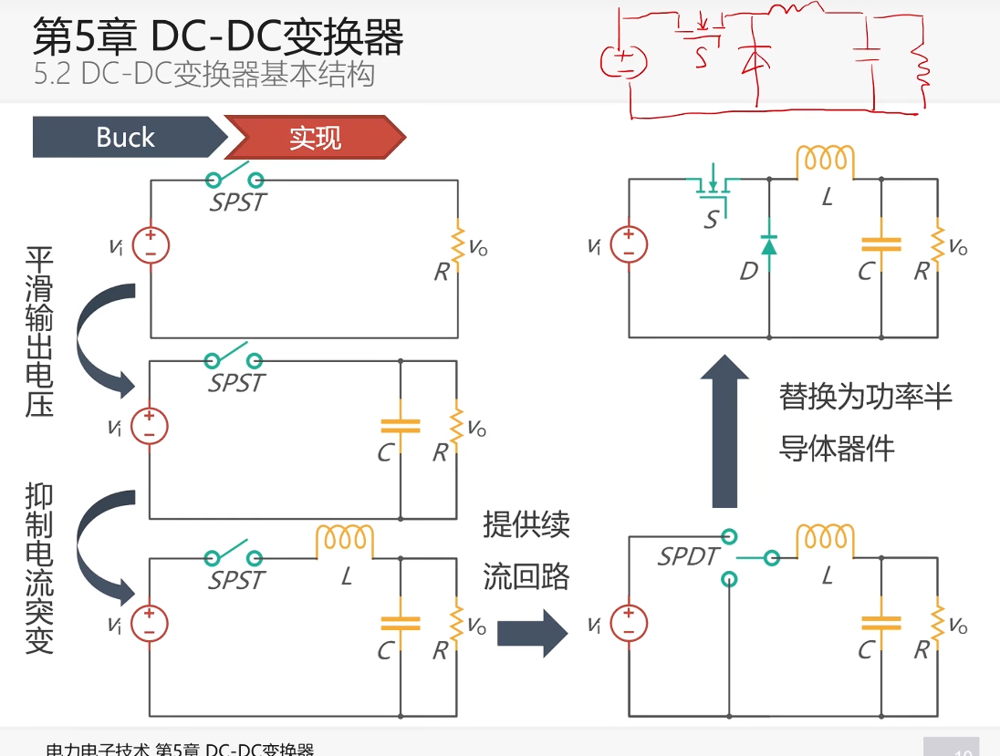


### boost电路
构造升压的思路有些困难，但是能量守恒，功率是不会变化的，所以升压就是在降流，不妨设计一个降流的电路(~~老师简直是个天才我去~~)
==记得自己推导公式😋==


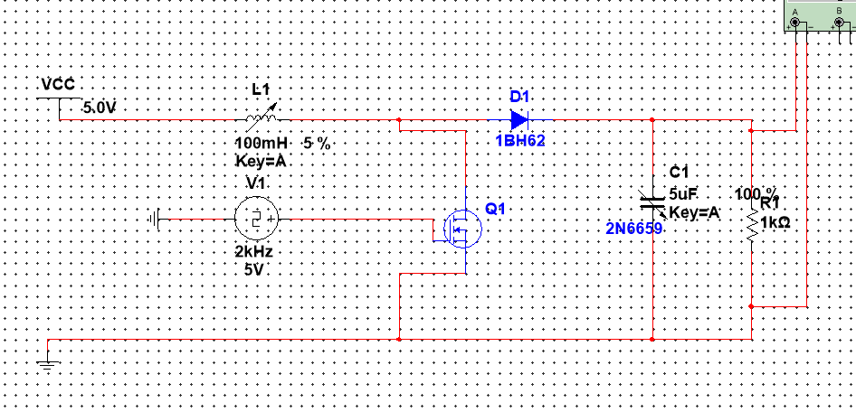

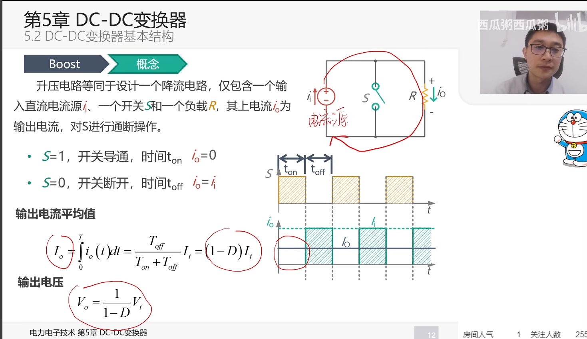

boost拓扑推导过程

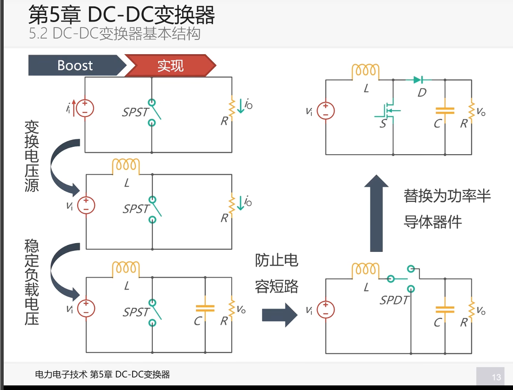
电流源可以转换为电压源的原因：
```
电流源的特点：1. 电流保持不变，电流源不可以开路，需要释放能量
而当开关从导通时由于电压保持不变，根据U=L * di/dt可以知道电流先线性上升
到断开时电压源串联的电感要保持电流不变，会有一段缓慢释放的过程，状态近似可以视为电流源
```
积分可得电流大小为$$ I~输出~=(1-D) * I~输入~ $$，其电流大小小于输入

接着我们要给后级稳定的输出，加入电容

再其次，为了避免在电感充电时电容中的能量消失，需要使用一个单刀双置开关
接着我们用mos和二极管实现

### buck-Boost
二合一即可实现即要降压功能又有升压功能的模块
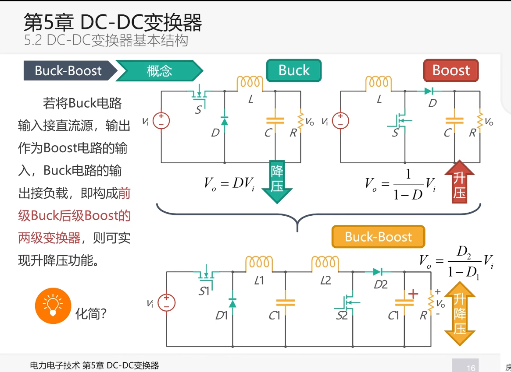
上图效果不好，要对它进行化简
- mos化简的可行性
  根据$$V~o~=D~1~/1-D~2~ * V~i~$$

  如果可以将两个调控的mos用一个解决就可以实现化简
  令D~1~=D~2~后注意到此时范围在0 to 无穷 所以说可行

- LCL & L 的化简

 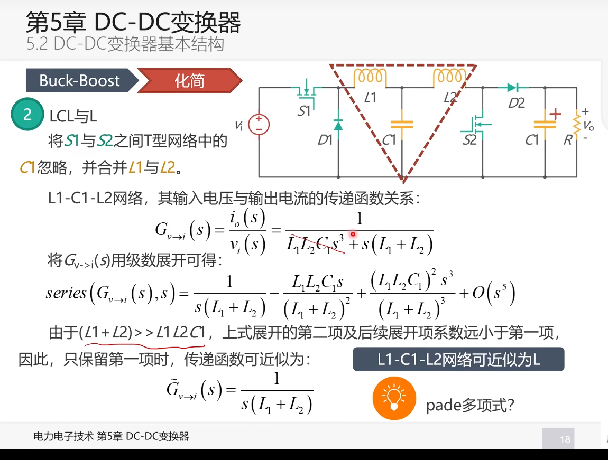(这个我没有看懂。。。:sob:)(拉普拉斯变换，

 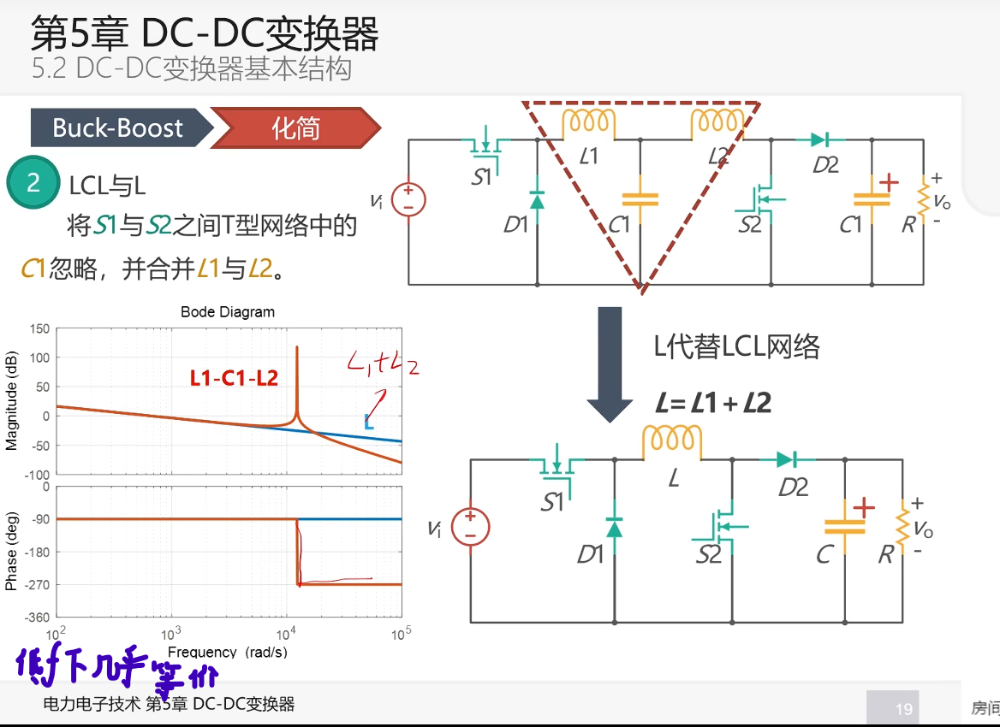

- 工作方式的提取
 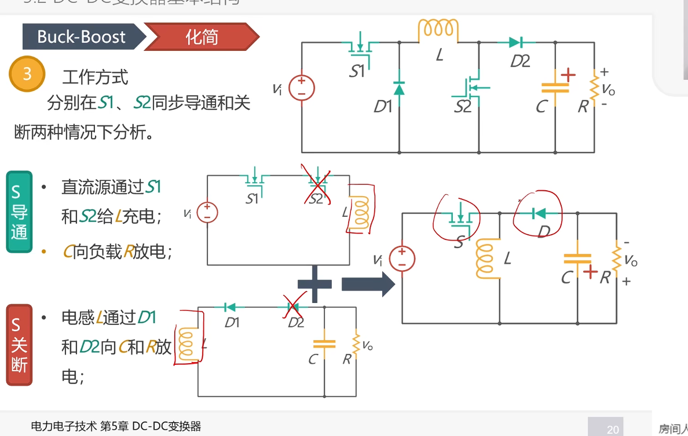


 

### 三者关联

太amazing了,把其中一个开关电源类型的支路同时旋转120就可以得到buck boost 或者buck-boost


### boost-buck

化简电路：
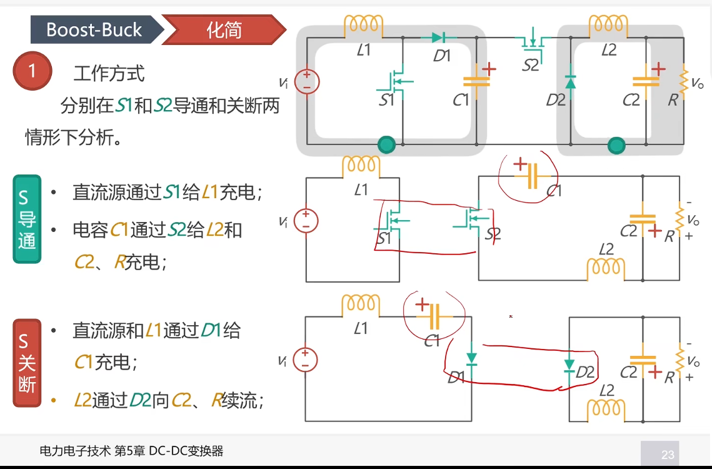
->
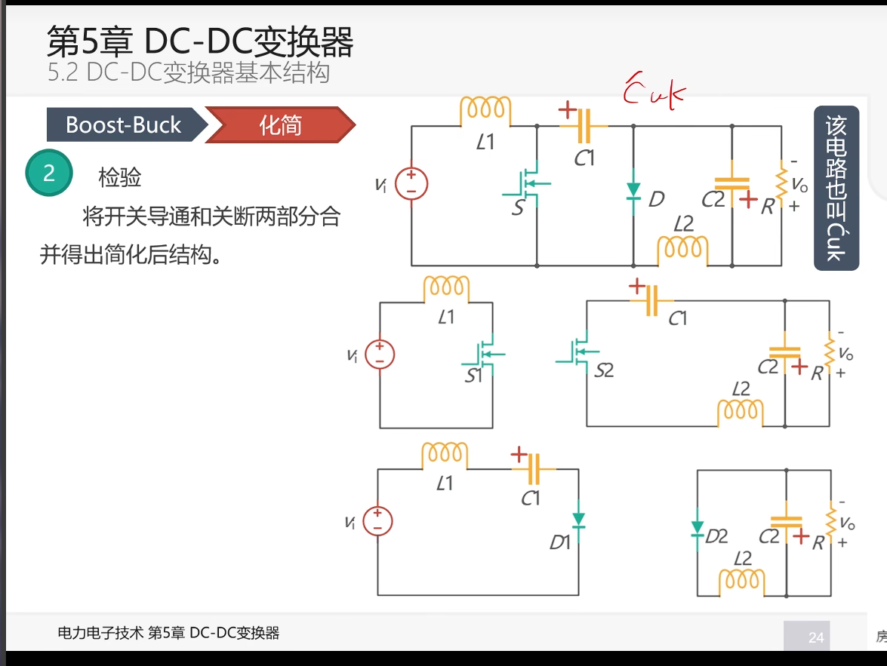


### 对升降压电路改造
(把cuk的输出电压极性反过来）

#### sepic(对输出改造）


#### Zeta(对输入改造)
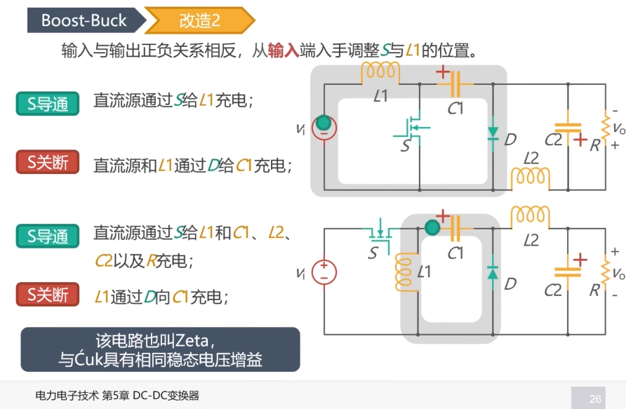


小结：


上述均为非隔离式dcdc变换器

### 理论分析
- 前提条件：
- 1. 变换器运行在稳态

## 隔离式dcdc

### 反激